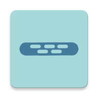
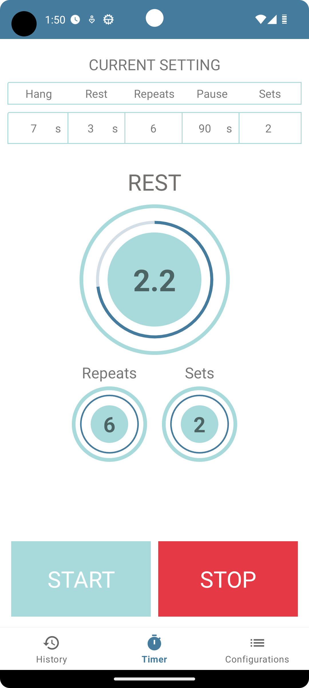
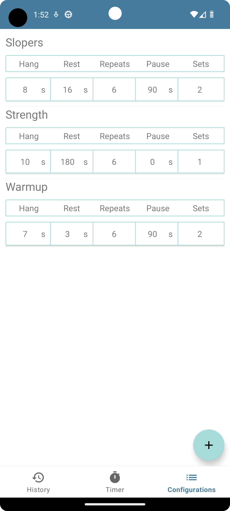
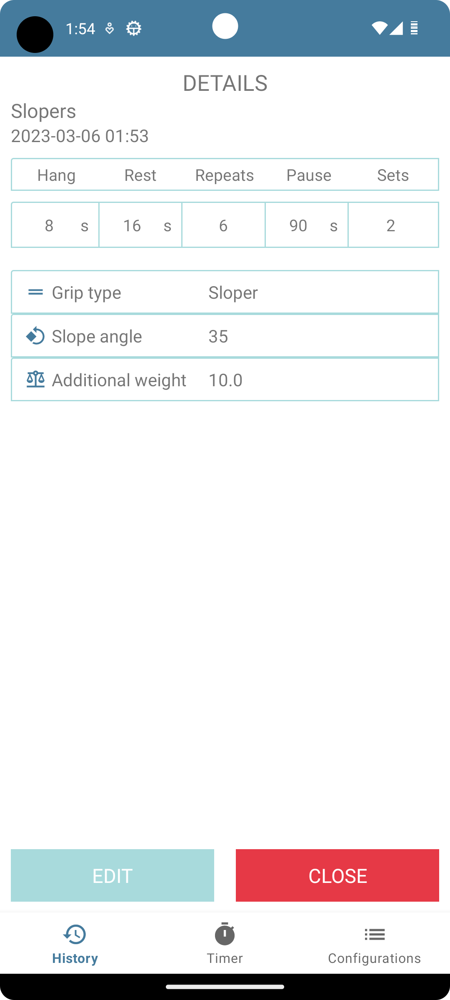
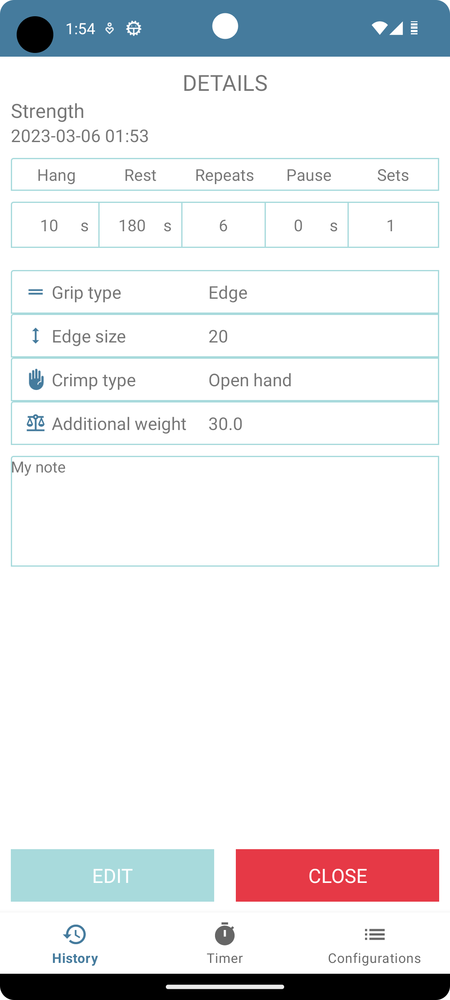
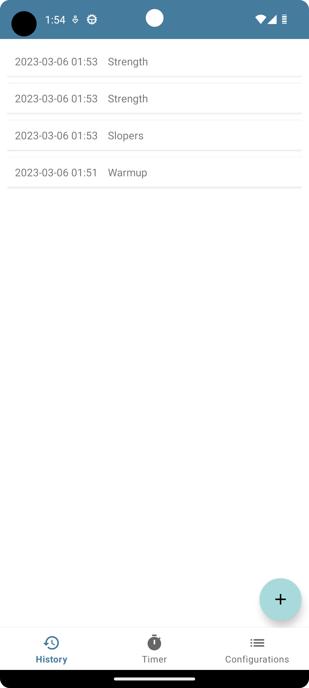

# Hangboard

## Table of contents

* [General](#General)
* [Tech](#Technologies)
* [Other](#Project Status)
* [Screenshots](#Screenshots)

## Describe

Hangboard - application dedicated for climbers to training on hangboard.

## Features

- Timer with the ability to set the time of hanging, rest, number of series and repetitions and pause time.
- Possibility to save any number of configurations
- Ability to save training history with details about: grip type, crimp type, additional weight and more.
- Sound alarm when exercise step ends.
- Notification in the notification bar with the current status of the exercise.

## Installation

To install and use app use build option in Android Studio or use this [APK](https://1drv.ms/u/s!ArukgIiDJtcOkjvV4spuIkwKQKB3?e=4Yb42q)
file.

## Supported devices

The application works on devices with Android 5.0 or higher.

## Technologies

- MVVM
- RoomDb
- Coroutines
- Navigation Component
- Fragments
- RecyclerView

## Architecture

Application uses `MVVM` as its architecture pattern. `HangboardActivity` is
the main activity of the app. It is composed of three main fragments: TimerFragment, 
SavedConfigurationsFragment and HistoryFragment with `Navigation Component`. The `ViewModel`
of this app is located in HangboardViewModel. `Exercise` class is responsible for calculating
the time and running the exercise. `RoomDb` support is located in the db folder. 

## Project Status

Project is in progress. 

## Contact

Created by [@Bartosz Filipów](https://www.linkedin.com/in/bartosz-filipow/) - feel free to contact me.

## Screenshots

